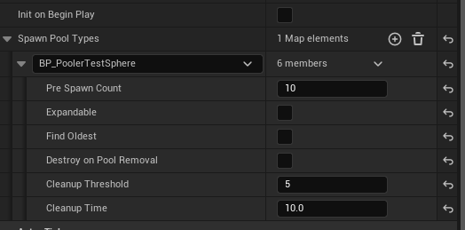
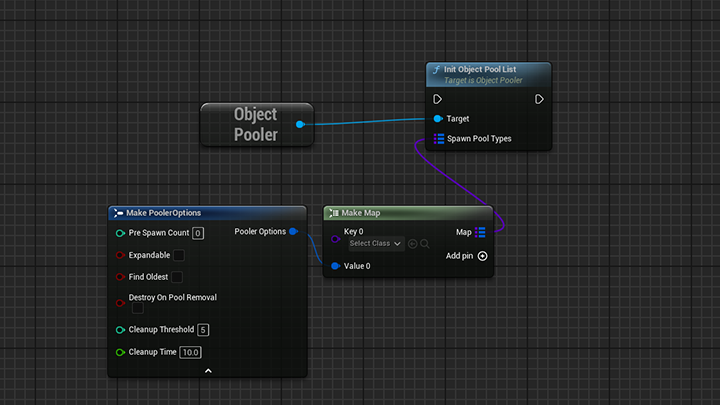
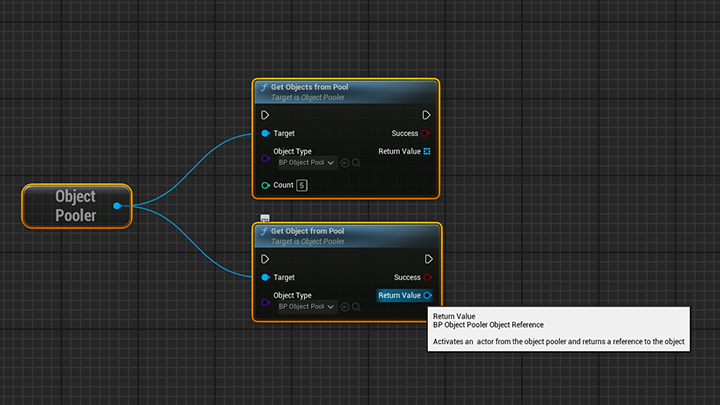
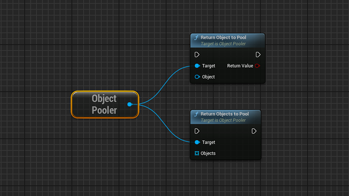
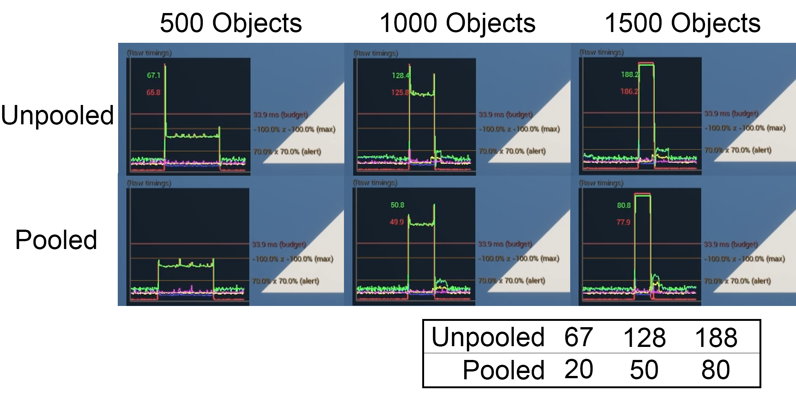

# Shrimple Object Pooling
**A lightweight simple to use Unreal Engine Plugin**

This is a simple object pooler plugin for Unreal Engine.

# Table of Contents
- [Supported Versions](#known-supported-versions)
- [What is Object Pooling?](#about-object-pooling)
- [Installation](#installation)
- [How to Use](#how-to-use-the-shrimple-object-pooler)
  - [Creating a Pool](#creating-an-object-pooler)
  - [Getting and Returning Objects](#getting-and-returning-objects)
  - [Settings](#pooling-settings)
- [Under the Hood](#under-the-hood)
- [Testing](#testing)
  - [Results](#results)

### Known Supported Versions
- 5.4.1
- 5.3.1

# About Object Pooling
### What is it?
An object pooler is a design pattern which minimises runtime allocation and deallocation of frequently used objects. 
This method pre spawns a number of objects at the start of the poolers lifetime and stores them in a list to be activated at a later time.
When the desired object is needed, the pooler will return an object (if it has one free), 

A large downside of object pooling is that the memory increases with the number of objects stored, deactivated pooled object still retain space in memory thus slowing down peformance on larger scales.

## Installation
1. Clone or download this repository.
2. Copy the `ShrimpleObjectPooler` folder into your project's `Plugins/` directory.
3. Open your Unreal project.
4. Enable the **ShrimpleObjectPooler** plugin via **Edit > Plugins**.
5. Recompile and restart the editor.

# How to use the Shrimple Object Pooler 
## Creating an Object Pooler
You can create a pool via:
- **Blueprint** using the provided `BP_ObjectPooler` actor
- **Code** via the `UObjectPoolerSubsystem`

The BP actor is designed to be placed in the level and initialized on Begin Play:

Alternatively, call the pooler init node manually (not recommended during gameplay):

## Getting and Returning Objects
To retrieve or return **single** or **multiple** objects to the pool, the following functions can be called:

- `Get Object(s) from Pool`
- `Return Object(s) to Pool`

All returned objects are of the correct type, avoiding unnecessary casting via Unreal’s reflection system.

#### Example Nodes:

All returned objects are of the correct type, avoiding unnecessary casting, courtesy of Unreal’s reflection system.

## Pooling Settings
The pooler has a few settings that can affect how the pooler operates. 

| Setting | Type | Default | Description |
|--------|------|---------|-------------|
| Pre Spawn Count | `int` | 10 | Number of actors to spawn at initialization |
| Expandable | `bool` | true | Should the pool grow if no objects are available |
| Find Oldest | `bool` | false | If pool is full, return the oldest active object |
| Destroy On Pool Removal | `bool` | false | Destroy all pooled actors when the pool is cleared |
| Cleanup Threshold | `int` | 10 | How many `nullptr` references trigger cleanup |
| Cleanup Time | `float` | 10.0 | How often (seconds) the pooler checks for cleanup |

## Under the Hood

- **Pre-Allocation with Array Reservation:**  
  Arrays reserve space upfront based on configured pool sizes to prevent costly reallocations during initialization.

- **Efficient Pool Management:**  
   Objects are stored in two arrays per pooled class — an *active* array and an *inactive* array. Instead of costly `RemoveAt()` calls that cause array reshuffling, returned objects are set to `nullptr` in the active array and placed into available slots in the inactive array. This approach minimizes memory reallocations and fragmentation, maintaining stable performance even with large pools.

- **Interface Enforcement:**  
  Only actors implementing the `IPooledObject` interface can be pooled, ensuring pooled objects support activation and deactivation hooks. This guarantees that actors correctly reset their state when reused.

- **Expandable Pools and Fallbacks:**  
  The pool supports dynamic expansion if configured, allowing new objects to spawn when the pool runs out. Additionally, it can be set to reuse the oldest active object, providing flexible object reuse strategies that fit different gameplay needs.

- **Configurable Per-Class Cleanup:**  
  A cleanup timer periodically compacts pooled arrays by removing invalid or destroyed actor references. This cleanup respects user-configured thresholds and frequencies on a per-class basis, optimizing runtime memory use without causing frame spikes.

- **Blueprint and Editor Friendly:**  
  Spawned pooled actors are organized under a dedicated editor folder (`/Pool`) to keep the world outliner tidy. Spawn parameters avoid deferred construction to ensure predictable initialization.

These design decisions together enable a highly performant, scalable, and easy-to-use object pooling system that fits seamlessly into Unreal Engine workflows.

# Testing

| Component | Specs |
|----------|-------|
| CPU | Ryzen 7 3800X |
| GPU | Nvidia RTX 3080 |
| RAM | 32GB DDR4 @ 3200MHz |
| SSD | Samsung Evo 970 Plus (512GB) |

To test performance of the system, both tests are called from blueprints.  
The C++ pooler should have no negligable difference to the blueprint spawn tests in terms of the BP vs C++ argument for performance.  
Both are itterated in blueprint, and like the object pooler functions, spawn actor of classs calls a C++ function, specifically from **`UKismetSystemLibrary`** 

### Test Method
**Pooled Test:**
- Initialize pool (causes a small spike)
- Retrieve object (looped)
- Wait 2 seconds
- Return all objects

**Non-Pooled Test:**
- Spawn all objects in loop
- Wait 2 seconds
- Destroy all actors manually

> [!WARNING]
> This test is an extreme scenario due to the volume of actors spawned.
> Each actor is also running a for loop with 100 increments each tick to mimic a heavyweight class

## Results
| Object Count | Normal Spawning | Pooled | Initialisation Spike (Pooled) |
|---------|-----------------|--------|---------------------|
| 500     | 67 ms           | <20 ms | 68 ms               |
| 1000    | 128 ms          | 50 ms  | 154 ms              |
| 1500    | 188 ms          | 80 ms  | 228 ms              |

- **Red = Game Thread Time**
- **Green = Total Frame Time**

 

